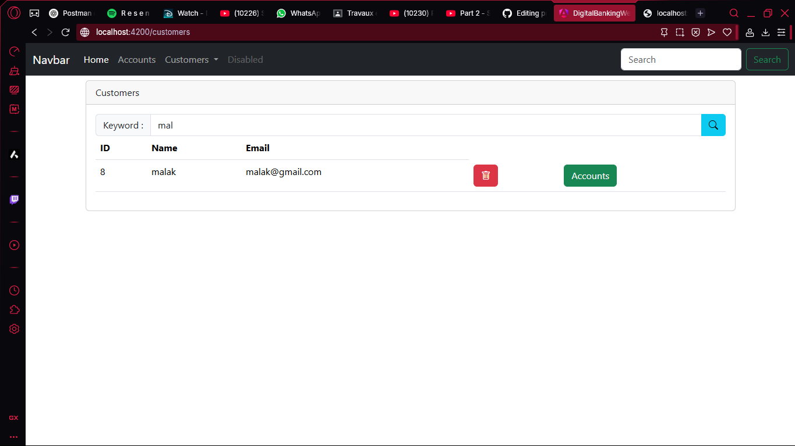
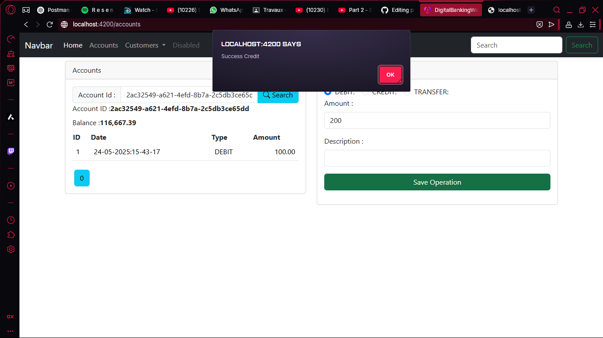

<h1>backend</h1>
<h2>base de donnne test</h2>

<h2>phpmyadmin</h2>

<h2>XAMPP</h2>

<h2>mapping and postman test</h2>

<h1>frontend</h1>
<h2>customers list</h2>

<h2>add customer</h2>

<h2>customer search</h2>

<h2>customers add formulaire</h2>

<h2>accounts search</h2>

<h2>accounts search by id</h2>

<h2>account credit add</h2>

<h2>credit added successfully</h2>

<h2>transfer</h2>

<h2>transfer successful</h2>

